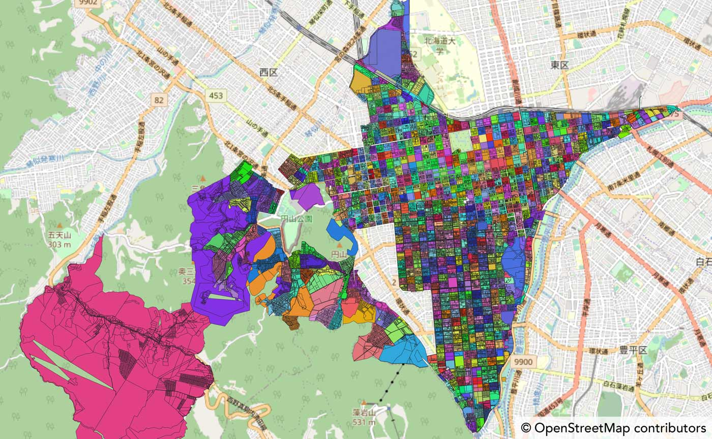

# qgis-mojxml-plugin

[](https://github.com/MIERUNE/qgis-mojxml-plugin/actions/workflows/test.yml) [](https://codecov.io/gh/MIERUNE/qgis-mojxml-plugin)

[QGIS](https://qgis.org/) で [法務省登記所備付地図データ](https://front.geospatial.jp/moj-chizu-xml-download/)（地図 XML）の変換や読み込みを行うためのプラグインです。

A QGIS plugin for converting Japanese “MOJ Map XML” (land registration polygon data) into geospatial formats. Currently, only Japanese language is supported.

[札幌市中央区のデータ](https://www.geospatial.jp/ckan/dataset/houmusyouchizu-2022-1-1)（取得日: 2023-03-15）を読み込んで、大字コードや丁目コードで塗り分けた例：



## 使い方

本プラグインは [QGIS Python Plugin Repository](https://plugins.qgis.org/plugins/mojxml_plugin/) で公開されており、QGIS の「プラグインの管理とインストール」から検索してインストールできます。

使い方：

1. QGIS のプロセッシングツールボックスを開いて、「法務省登記所備付地図データ」→「地図 XML/ZIP を読み込む」を選択します。
2. 「地図 XML/ZIP を読み込む」のダイアログが表示されます。

   1. 「地図 XML/ZIP ファイル」で、読み込みたいファイル（.zip または .xml）を指定します。
   2. （任意）必要であれば「任意座標系のデータを含める」「地区外・別図を含める」をチェックします。
   3. （任意）「出力ファイル」で出力先やファイル形式を選択します（未指定の場合は一時レイヤに作成されます）。

3. 「実行」をクリックします。巨大なファイルを読み込む場合は処理に時間がかかります。

## Development

Setup development environment:

```bash
make init
```

Deploy to QGIS:

```bash
make deploy
```

Run test:

```bash
make test
```

## License

GPL v2

This plugin contains [MIERUNE/mojxml-py](https://github.com/MIERUNE/mojxml-py), which is licensed under the MIT License.

## Authors

- MIERUNE Inc.
- Taku Fukada ([@ciscorn](https://github.com/ciscorn) - original author

